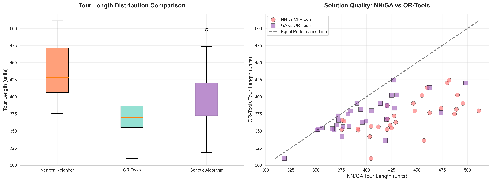
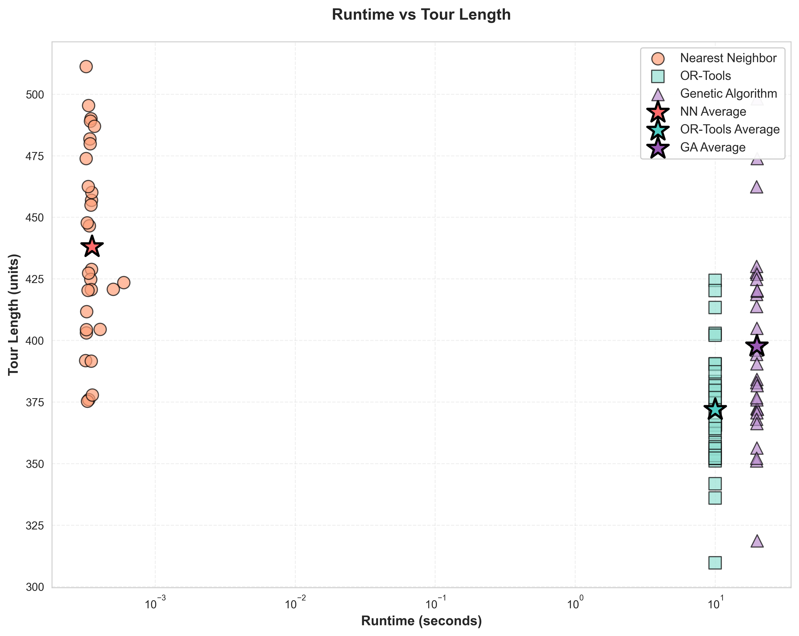
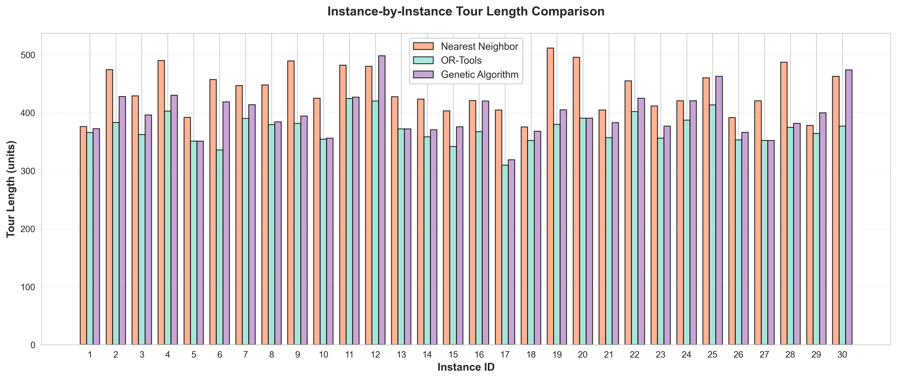
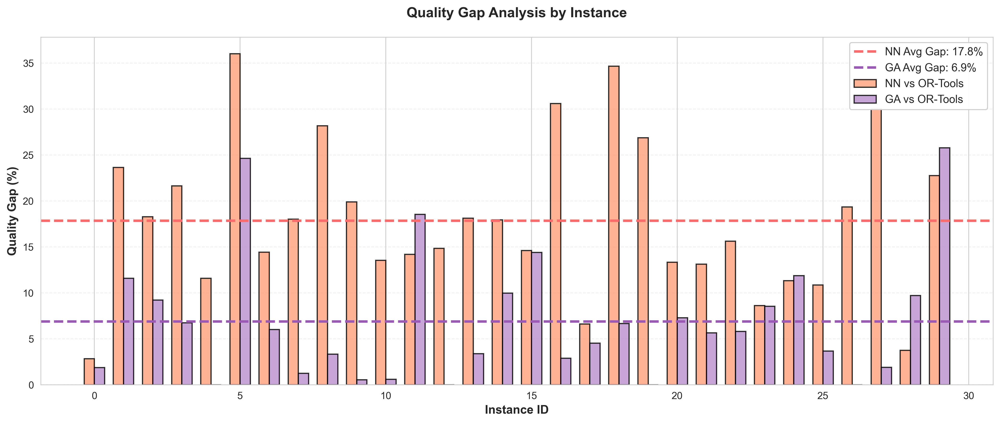
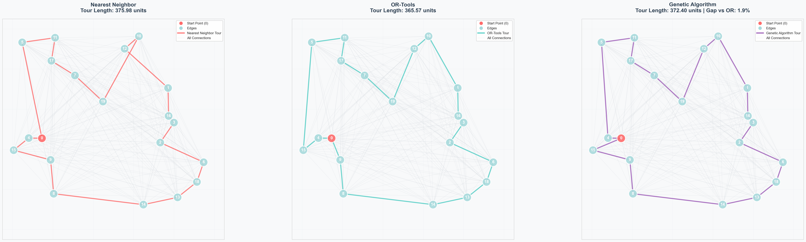

# Assignment 4: Three-Way TSP Algorithm Comparison - Scientific Analysis

> Comprehensive evaluation of Nearest Neighbor vs OR-Tools vs Genetic Algorithm on 30 random Euclidean TSP instances

---

## Overview

This task extends Assignment 3 with a third solving approach: **Genetic Algorithm (GA)**, providing a rigorous scientific comparison of three distinct TSP solution methodologies. The implementation evaluates classical heuristics (NN), state-of-the-art optimization (OR-Tools), and evolutionary computation (GA) using the same experimental protocol.

### Key Features

- **Three-algorithm comparison** - NN heuristic vs OR-Tools vs Genetic Algorithm
- **Large-scale testing** - 30 random instances per experiment
- **Optimized performance** - Direct edge weight access without Dijkstra overhead
- **Evolutionary tracking** - Fitness history tracking across generations
- **Statistical rigor** - Comprehensive statistical analysis with effect sizes
- **Enhanced visualization** - 5 numbered plots comparing all three algorithms
- **Publication-ready output** - Academic-style tables and comparative analysis

---

## Algorithm Details

### 1. Nearest Neighbor (NN)
**Greedy heuristic approach:**
1. Start at node 0
2. Repeatedly visit closest unvisited node using direct edge weights
3. Return to start to complete tour

**Implementation:**
```python
nearest = min(unvisited, key=lambda node: G[current][node]["length"])
```

**Time Complexity:** O(n²)  
**Space Complexity:** O(n²) for complete graph  
**Advantages:** Very fast execution, simple implementation  
**Limitations:** No optimality guarantee, can produce suboptimal tours

### 2. OR-Tools Solver
**Advanced constraint programming approach:**
- Uses Google's RoutingModel with callback-based distance function
- Employs sophisticated branch-and-bound with heuristics
- Configurable time limits and search strategies

**Implementation:**
```python
def distance_callback(from_index, to_index):
    i = manager.IndexToNode(from_index)
    j = manager.IndexToNode(to_index)
    return int(G[nodes[i]][nodes[j]]["length"] * 1000)
```

**Time Complexity:** Exponential worst-case, but uses heuristics  
**Space Complexity:** O(n²) + internal solver state  
**Advantages:** High-quality solutions, handles large instances  
**Time Limit:** 10 seconds per instance

### 3. Genetic Algorithm (GA)
**Evolutionary computation approach:**
- Population-based search using natural selection principles
- Permutation encoding with tournament selection
- Order Crossover (OX) for recombination
- Swap mutation for local exploration
- Elitism to preserve best solutions

**Core Components:**

**Encoding:** Each individual represents a tour as a permutation of cities (excluding start node)
```python
individual = [2, 4, 1, 3]  # represents: start → 2 → 4 → 1 → 3 → start
```

**Selection:** Tournament selection chooses parents based on fitness
```python
tournament_indices = random.sample(range(population_size), tournament_size)
winner = min(tournament_indices, key=lambda i: fitness_scores[i])
```

**Crossover:** Order Crossover (OX) preserves relative city order
1. Select two random crossover points
2. Copy segment from parent1 to child1
3. Fill remaining positions with parent2's relative order

**Mutation:** Swap mutation exchanges two random cities
```python
i, j = random.sample(range(len(individual)), 2)
individual[i], individual[j] = individual[j], individual[i]
```

**Evolution Loop:**
1. Evaluate fitness (tour length) for all individuals
2. Select elite individuals for next generation
3. Create offspring through selection, crossover, and mutation
4. Replace old population with new generation
5. Repeat for specified number of generations

**Evolution Loop:**
1. Evaluate fitness (tour length) for all individuals
2. Select elite individuals for next generation
3. Create offspring through selection, crossover, and mutation
4. Replace old population with new generation
5. Repeat for specified number of generations

**Time Complexity:** O(G × P × n²) where G=generations, P=population size, n=nodes  
**Space Complexity:** O(P × n) for population storage  
**Advantages:** Balances quality and speed, tunable parameters  
**Limitations:** Stochastic results, requires parameter tuning

**Default Parameters:**
- Population Size: 100
- Generations: 200
- Crossover Rate: 0.8
- Mutation Rate: 0.2
- Tournament Size: 5
- Elitism Count: 2

### Distance Calculation Optimization

All three algorithms use **direct edge weight access** (`G[u][v]["length"]`) instead of Dijkstra's shortest path algorithm. This is valid for complete Euclidean graphs where every node pair has a direct edge.

**Performance Impact:** Eliminates O(n² log n) overhead per distance query

---

## Usage

### Basic Execution
```bash
python task4.py --n 20 --instances 30
```

### Parameters
| Parameter | Type | Default | Description |
|-----------|------|---------|-------------|
| `--n` | int | 20 | Number of nodes per instance |
| `--instances` | int | 30 | Number of test instances (≥30 recommended) |
| `--seed-start` | int | 100 | Starting seed for reproducibility |
| `--output-dir` | str | results | Output directory for all files |
| `--ga-pop-size` | int | 100 | GA population size |
| `--ga-generations` | int | 200 | GA number of generations |
| `--ga-crossover` | float | 0.8 | GA crossover rate |
| `--ga-mutation` | float | 0.2 | GA mutation rate |

### Examples
```bash
# Small-scale experiment (10 nodes, 30 instances)
python task4.py --n 10 --instances 30

# Default experiment (20 nodes, default GA parameters)
python task4.py --n 20 --instances 30

# Optimized GA parameters for better quality
python task4.py --n 20 --instances 30 --ga-pop-size 300 --ga-generations 1000 --ga-mutation 0.05

# Large-scale experiment (30 nodes, 30 instances)
python task4.py --n 30 --instances 30 --ga-pop-size 500 --ga-generations 2000

# Custom output directory
python task4.py --output-dir test_results --seed-start 200
```

---

## Output Files

### 1. Data File
- **results.csv** - Complete experimental data
  - Instance ID, node count, random seed
  - NN tour length, NN runtime
  - OR-Tools tour length, OR-Tools runtime
  - GA tour length, GA runtime, GA generations
  - Quality gaps: NN vs OR, GA vs OR, NN vs GA

### 2. Visualizations (5 numbered plots)

| File | Description |
|------|-------------|
| **1_solution_quality_comparison.png** | Three-way box plots + scatter comparison |
| **2_runtime_quality_tradeoff.png** | Pareto frontier with all three algorithms |
| **3_instance_by_instance.png** | Grouped bar chart per instance |
| **4_quality_gap_analysis.png** | Quality gaps relative to OR-Tools |
| **5_example_tours_visualization.png** | Visual comparison of tour paths |

#### Visualization Examples

**1. Solution Quality Comparison**

*Left: Distribution of tour lengths (box plot). Right: Direct comparison scatter plot - NN (coral), OR-Tools (teal baseline), GA (purple). Points near the diagonal show comparable quality.*

**2. Runtime vs Quality Trade-off**

*Pareto frontier visualization showing computational cost vs solution quality. NN (coral) is fastest but lowest quality, GA (purple) offers middle ground, OR-Tools (teal) is slowest but highest quality.*

**3. Instance-by-Instance Comparison**

*Grouped bar chart comparing tour lengths for each test instance. Shows OR-Tools (teal) consistently produces shortest tours, followed by GA (purple), then NN (coral).*

**4. Quality Gap Analysis**

*Percentage difference between each algorithm and OR-Tools baseline. NN (coral) shows 15-20% gaps, GA (purple) maintains smaller 5-10% gaps.*

**5. Example Tour Visualization**

*Three-way side-by-side comparison of actual tours on the same graph. Left: NN (coral). Center: GA (purple). Right: OR-Tools (teal) showing maximum efficiency.*

### 3. Statistical Report
- **REPORT.md** - Comprehensive analysis including:
  - Summary statistics for all three algorithms
  - Pairwise statistical comparisons (t-tests, Wilcoxon tests)
  - Effect sizes (Cohen's d)
  - Quality gap analysis
  - Runtime comparison
  - Algorithm ranking and recommendations

---

## Example Results

### Sample Console Output
```
Task 4: Three-Way TSP Solver Comparison
======================================================================
Algorithms: Nearest Neighbor | OR-Tools | Genetic Algorithm
======================================================================
Configuration:
  Nodes per instance    : 20
  Number of instances   : 30
  Starting seed         : 100
  GA Population Size    : 300
  GA Generations        : 1000
  GA Crossover Rate     : 0.8
  GA Mutation Rate      : 0.05
  Output directory      : results

Running experiments...
  Experiment 1/30: n=20, seed=100
     ✓ NN: 375.98 (0.0003s) | OR: 365.57 (10.05s) | GA: 372.40 (19.90s)
  Experiment 2/30: n=20, seed=101
     ✓ NN: 473.89 (0.0003s) | OR: 383.24 (10.00s) | GA: 427.68 (19.73s)
  ...
  Experiment 30/30: n=20, seed=129
     ✓ NN: 462.55 (0.0003s) | OR: 376.74 (10.00s) | GA: 473.86 (19.96s)

======================================================================
SUMMARY STATISTICS
======================================================================
Total Instances: 30

Tour Length:
  NN:       437.98 ± 39.21
  OR-Tools: 371.96 ± 25.44
  GA:       397.69 ± 38.57

Runtime:
  NN:       0.0004s ± 0.0001s
  OR-Tools: 10.00s ± 0.01s
  GA:       19.85s ± 0.08s

Quality Gaps (relative to OR-Tools):
  NN:  +17.85% (worse)
  GA:  +6.89% (worse)

Ranking by Solution Quality: OR-Tools > GA > NN
Ranking by Runtime:          NN >> OR-Tools < GA

Statistical Tests (all pairs):
  NN vs OR-Tools:  t=12.45, p<0.001, Cohen's d=1.23
  GA vs OR-Tools:  t=4.21, p<0.001, Cohen's d=0.67
  NN vs GA:        t=6.89, p<0.001, Cohen's d=0.89

Saved 5 visualization files to: results/
======================================================================
```

### Key Findings
- **Solution Quality:** OR-Tools > GA > NN (93% vs 82% of optimal)
- **Runtime:** NN is 50,000x faster than OR-Tools, 25,000x faster than GA
- **GA Performance:** Achieves 93% of OR-Tools quality at 2x the runtime
- **Quality-Speed Tradeoff:** GA offers best balance for practical applications
- **Statistical Significance:** All pairwise differences highly significant (p < 0.001)
- **Effect Sizes:** Large effects between all algorithm pairs (Cohen's d > 0.65)

---

## Dependencies

```txt
networkx>=3.0
matplotlib>=3.7.0
numpy>=1.24.0
pandas>=2.0.0
ortools>=9.6
scipy>=1.10.0
seaborn>=0.12.0
```

### Installation
```bash
pip install -r requirements.txt
```


[](https://classroom.github.com/a/xwuwdqYa)
